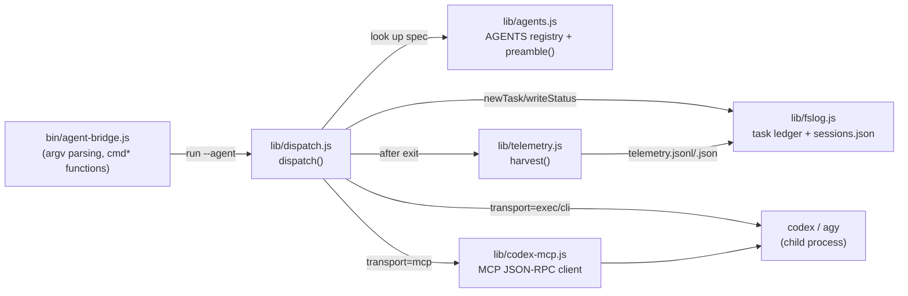

# Architecture overview

`agent-bridge` has four layers: a CLI entrypoint, a dispatcher, a per-agent registry, and a
filesystem-backed task ledger. See [Task dispatch lifecycle](../workflows/task-dispatch-lifecycle.md)
for the runtime sequence and [Agent registry contract](../api/agent-registry.md) for what each
registry entry must implement.

## CLI entrypoint (`bin/agent-bridge.js`)

A single switch over `process.argv` dispatches to one `cmd*` function per subcommand — `run`,
`list`, `sessions`, `warm`, `status`/`result`/`watch`, `tokens`/`otel`, `dashboard`/`up`/`down`/
`open`/`autostart`/`service`, `install`, `doctor` (`bin/agent-bridge.js:300-323`). `run`'s flags
are parsed by `parseRun()` into an options object (`agent, cwd, sandbox, transport, prompt,
verify, isolate, pr, session, model`) that flows straight into `dispatch()`
(`bin/agent-bridge.js:75-92`). Full flag-by-flag reference: [CLI reference](../api/cli-reference.md).

## Dispatcher (`lib/dispatch.js`)

`dispatch()` is the single orchestration point for one `run` invocation
(`lib/dispatch.js:271-323`):

1. Look up the agent's spec in `AGENTS` (from `lib/agents.js`); reject unknown agents/sandboxes.
2. Resolve `transport`: `codex` defaults to `mcp` (or `exec` if requested); other agents
   reject `--transport` entirely (`effectiveTransport()`, `lib/dispatch.js:56-60`).
3. If `--session <name>` names an existing session, reuse its `cwd`/worktree/thread id
   instead of starting fresh. If `--isolate` (or `--pr`, which implies it) is set instead,
   create a private git worktree + branch. See
   [Sessions, worktrees & PRs](../workflows/sessions-worktrees-and-pr.md).
4. Create the task directory via `fslog.newTask()`, build the work-log preamble via
   `preamble()`, and hand off to one of two transport runners:
   - `runMcpTransport()` — Codex only, talks to a `codex mcp-server` child through
     `lib/codex-mcp.js` (`lib/dispatch.js:134-205`).
   - `runProcessTransport()` — spawns the agent's CLI directly using `spec.build()` /
     `spec.resumeBuild()` and parses its stdout line-by-line with `spec.parse()`
     (`lib/dispatch.js:207-269`).
5. On exit, `finishTask()` backstops `status.md`/`result.md` if the agent didn't finish the
   protocol itself, snapshots the worktree diff, calls `telemetry.harvest()`, saves the
   session (if named), and — if `--pr` was set and the run succeeded — commits, pushes, and
   opens a PR (`lib/dispatch.js:81-132`, `openPullRequest()` at `lib/dispatch.js:25-54`).

The dispatcher deliberately backstops but never overrides an agent's own terminal status: if
the agent already wrote `status: blocked`, `finishTask()` leaves it alone
(`terminalStatus()`, `lib/dispatch.js:66-70`).

## Agent registry (`lib/agents.js`)

`AGENTS` is a plain object keyed by agent name (`codex`, `antigravity`); each entry supplies
the shell command to run, how to parse its output, and how to resume a session. See
[Agent registry contract](../api/agent-registry.md) for the full shape and how to add a new
executor. `preamble()` in the same file generates the work-log instructions prepended to every
prompt — it has two forms depending on whether the agent can reliably write its own
`status.md` (`selfStatus`), since Antigravity writes into its own `--add-dir` workspace and
can't reliably target a second directory (`lib/agents.js:41-84`, `lib/agents.js:128-134`).

## Task ledger (`lib/fslog.js`)

All task state lives under `$AGENT_BRIDGE_HOME` (default `~/.agent-bridge/`). `fslog.js` owns:

- **Task lifecycle** — `newTask()` creates `<TASKS>/<id>/` with a generated id
  (`YYYYMMDDHHMMSS-<slug>-<random>`), writes the initial `task.md` and a `queued` `status.md`,
  and refreshes the `latest` symlink (`lib/fslog.js:39-85`).
- **Status protocol** — `writeStatus`/`readStatus`/`patchStatus` serialize/parse the flat
  `key: value` frontmatter + Markdown body format shared by `task.md`, `status.md`, and
  `result.md` (`lib/fslog.js:46-106`).
- **Named sessions** — `sessions.json` maps a session name to the agent, transport, thread/
  session id, worktree, and branch, so a later `--session <name>` run can resume exactly where
  it left off (`lib/fslog.js:125-142`).

## Transports, summarized

| Transport | Agent | How it runs |
|---|---|---|
| `mcp` (default) | codex | long-lived `codex mcp-server` child, JSON-RPC over stdio via `lib/codex-mcp.js`; supports resuming a thread with `codex-reply` |
| `exec` | codex | `codex exec --json ...` one-shot process per turn, `--transport exec`; resumable via `codex exec resume <sessionId>` |
| `cli` | antigravity | `agy -p <prompt> ...` one-shot process; resumable via `agy --conversation <id>` |

`effectiveTransport()` enforces that `--transport` is Codex-only (`lib/dispatch.js:56-60`).
