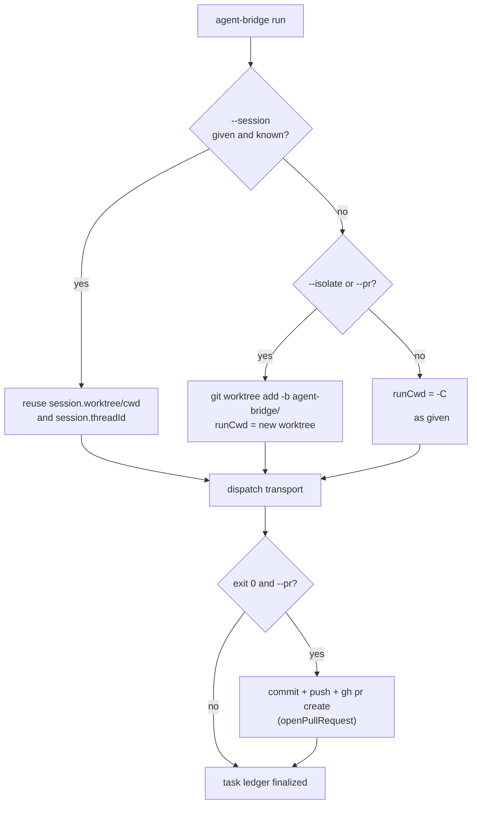

# Sessions, worktrees, and the PR flow

`agent-bridge run` on its own is one-shot and runs in the target repo's working directory. Three
flags/subcommands extend that: `--session` (resume a conversation), `--isolate`/`--pr` (run in
a private git worktree, optionally shipped as a PR), and `warm` (a persistent alternative to
`--session` for Codex). See [Task dispatch lifecycle](task-dispatch-lifecycle.md) for where
these decisions happen inside `dispatch()`.

## Named sessions (`--session <name>`)

A session is a row in `~/.agent-bridge/sessions.json` (`fslog.loadSessions/getSession/
saveSession`, `lib/fslog.js:125-142`) mapping a human-chosen name to `{agent, transport,
sessionId/threadId, cwd, worktree, branch, turns, lastTask}`.

- First `run --session api-refactor ...` on an agent creates the session after the task
  finishes, once `finishTask()` resolves a session/thread id (`lib/dispatch.js:113-122`).
- A later `run --session api-refactor "next turn"` looks the session up before dispatching
  (`dispatch()`, `lib/dispatch.js:280-284`), rejects if it belongs to a different agent or a
  different Codex transport, and reuses its `worktree`/`cwd` as the run's working directory
  (`lib/dispatch.js:292-295`) and its `threadId` for `resumeBuild()`/`codex-reply`.
- `agent-bridge sessions` lists every saved session (name, agent, turn count, id).

This is the mechanism behind the README's "reuse the agent's conversation + worktree across
runs" — each turn is still a fresh process (or MCP call), but it inherits the exact file state
and native conversation of the last turn.

## Warm daemon (`agent-bridge warm`) — a persistent alternative for Codex

`--session` still pays the cost of spawning `codex mcp-server` fresh per `run`. The warm daemon
(`lib/warm-daemon.js`) instead keeps **one** `codex mcp-server` process alive continuously and
routes named sessions to it as threads over local HTTP:

- `agent-bridge warm up` starts the daemon as a detached background process
  (`service.startDaemon`, `bin/agent-bridge.js:216-223`).
- `agent-bridge warm send --session <name> [-C dir] "prompt"` posts to `POST /send` on the
  daemon; `handleSend()` looks up (or creates) the session's `{threadId, cwd}` in memory (or
  hydrates it from `sessions.json` via `savedSession()`), calls `server.start()` or
  `server.reply()` on the one warm MCP connection, and writes the same task-ledger artifacts
  (`task.md`/`status.md`/`result.md`/`events.jsonl`/`telemetry.*`) a normal `run` would
  (`lib/warm-daemon.js:53-141`).
- `agent-bridge warm status` / `warm down` check or stop it.

Use `warm` when you expect many quick turns on the same Codex session and want to avoid the
per-turn MCP server startup cost; use plain `--session` when turns are infrequent.

## Worktree isolation (`--isolate`)

Since Antigravity's write mode (`--dangerously-skip-permissions`) and Codex's
`workspace-write` sandbox both remove the OS as a collision boundary, `--isolate` gives each
run its own git worktree and branch so concurrent agents on the same repo never step on each
other (`lib/dispatch.js:289-291`, comment at `lib/dispatch.js:289`):

1. Requires the target dir to already be a git repo (`isGitRepo()`).
2. Creates branch `agent-bridge/<taskId>` and a worktree at
   `$AGENT_BRIDGE_HOME/worktrees/<taskId>`, retrying up to 5 times on lock contention from
   concurrent `git worktree add` calls (`lib/dispatch.js:296-311`).
3. The agent runs with `runCwd` pointed at that worktree instead of the original repo.

A session that was created with a worktree (`--isolate` or `--pr` on turn one) automatically
reuses that same worktree on later `--session` turns (`lib/dispatch.js:292-295`), so a
multi-turn task stays on one branch throughout.

## PR flow (`--pr`)

`--pr` implies `--isolate` (`bin/agent-bridge.js:87`). After a successful run (exit code 0),
`openPullRequest(worktree, branch, agent, prompt, dir)` (`lib/dispatch.js:25-54`):

1. Bails out early (returning a `{skipped: "..."}` reason, not an error) if there's no `origin`
   remote or no `gh` CLI.
2. Deletes `activity.jsonl` from the worktree (the self-journal artifact) so the PR diff only
   contains the actual deliverable, stages everything, and bails if there's nothing staged.
3. Commits as `"<agent>: <first line of prompt>"`, pushes the branch, and either finds an
   already-open PR for that branch (later turns of the same session update it) or opens a new
   one with `gh pr create`. The PR body embeds the task's telemetry rollup (actions/commands/
   fileChanges, and whether the hash chain verified) and a pointer to the task ledger.

Nothing here bypasses the "review before keeping" rule from the skills
(`skills/codex-send/SKILL.md`, `skills/agy-send/SKILL.md`) — `--pr` still requires a human (or
Claude, as the planner) to review the opened PR; the bridge only automates the mechanical
commit/push/PR-create steps once the agent's work already succeeded.
