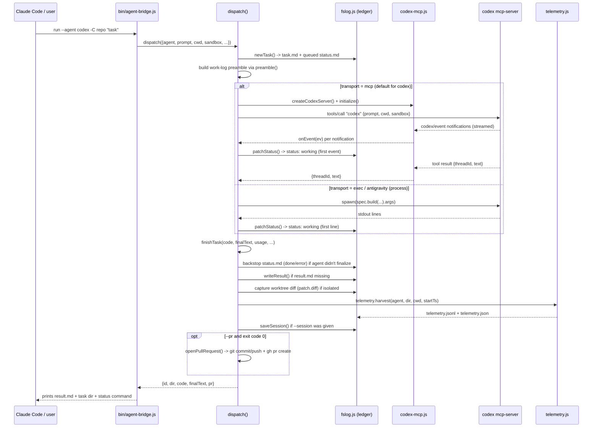

# Task dispatch lifecycle

This walks one `agent-bridge run --agent codex ...` call end to end. See
[Architecture overview](../architecture/overview.md) for the component map and
[Agent registry contract](../api/agent-registry.md) for what `spec` provides.

## Step detail

1. **Task creation** — `fslog.newTask()` mints an id (`YYYYMMDDHHMMSS-<slug-of-prompt>-
   <random>`), writes `task.md` with the assignment frontmatter, writes a placeholder
   `status.md` (`status: queued`, body `"Waiting for the agent to start…"`), and repoints the
   `latest` symlink (`lib/fslog.js:39-85`).
2. **Preamble** — `preamble({id, agent, statusFile, selfStatus})` is prepended to the raw task
   prompt so the executor knows the work-log protocol before it starts
   (`lib/agents.js:44-84`).
3. **Transport branch** — `dispatch()` picks `runMcpTransport()` only for `agent === "codex"`
   with `transport === "mcp"`; everything else goes through `runProcessTransport()`
   (`lib/dispatch.js:317-322`). Both write raw output to `events.jsonl` as they go and flip
   `status.md` to `working` on the first observed output (`markWorking()` /
   inline in `onLine()`, `lib/dispatch.js:147-152`, `223-231`).
4. **Finalization (`finishTask()`, `lib/dispatch.js:81-132`)** runs once, from either
   transport's `finish(code)` callback:
   - Compute `terminalStatus()`: if the agent already wrote `status: blocked`, leave it;
     otherwise `done` (exit 0) or `error`.
   - If the status file is still in a non-terminal or placeholder state, the dispatcher writes
     the terminal status itself — this is the "backstop" the module doc describes
     (`lib/dispatch.js:2-9`).
   - Write `result.md` if the agent never wrote one, from `finalText` → raw stdout → error text
     → `"(no output)"`, in that priority.
   - If running in a worktree, `captureWorktree()` stages everything and writes `patch.diff`
     plus a `git diff --stat` summary into `task.md`'s frontmatter.
   - Rewrite `task.md` with final `status`, `finished` timestamp, `usage`, `transport`, and
     (if isolated) `worktree`/`branch`/`diffstat`.
   - Call `telemetry.harvest()` — see
     [Telemetry and dashboard data flow](../architecture/telemetry-and-dashboard.md).
   - If `--session` was given, resolve the best available session id (transport-returned
     `threadId` → `spec.extractSessionId()` → the pre-existing session's id) and persist it via
     `fslog.saveSession()`.
   - If `--pr` was given and the run succeeded, call `openPullRequest()`.

## Non-goals baked into the design

Per `docs/CODEX_MCP_BRIDGE_ARCHITECTURE.md`, the bridge never commits, pushes, merges, or
deploys on its own initiative — the only path that touches git remotes is the explicit `--pr`
flag, and even then only after the agent's run has already exited successfully.
